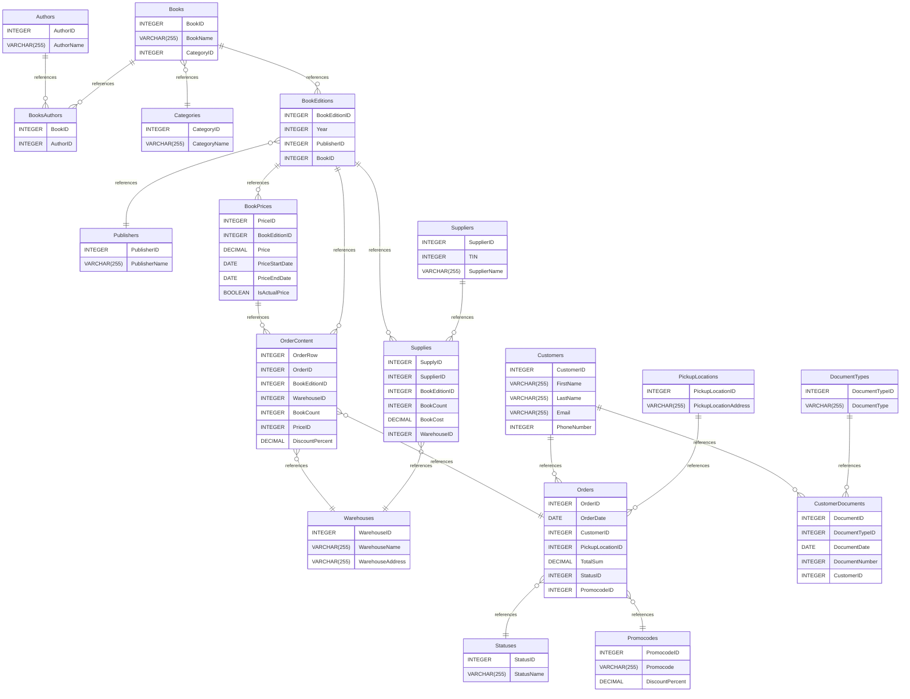

# OTUS_01_BooksOnline documentation
## Summary

- [Introduction](#introduction)
- [Database Type](#database-type)
- [Table Structure](#table-structure)
	- [Books](#books)
	- [Authors](#authors)
	- [BooksAuthors](#booksauthors)
	- [Categories](#categories)
	- [Publishers](#publishers)
	- [BookEditions](#bookeditions)
	- [Suppliers](#suppliers)
	- [Supplies](#supplies)
	- [Warehouses](#warehouses)
	- [BookPrices](#bookprices)
	- [Orders](#orders)
	- [PickupLocations](#pickuplocations)
	- [Customers](#customers)
	- [CustomerDocuments](#customerdocuments)
	- [DocumentTypes](#documenttypes)
	- [OrderContent](#ordercontent)
	- [Statuses](#statuses)
	- [Promocodes](#promocodes)
- [Relationships](#relationships)
- [Database Diagram](#database-diagram)

## Introduction

## Database type

- **Database system:** MySQL
## Table structure

### Books

| Name        | Type          | Settings                      | References                    | Note                           |
|-------------|---------------|-------------------------------|-------------------------------|--------------------------------|
| **BookID** | INTEGER | 🔑 PK, not null, unique, autoincrement | fk_Books_BookID_BooksAuthors,fk_Books_BookID_BookEditions | |
| **BookName** | VARCHAR(255) | not null |  | |
| **CategoryID** | INTEGER | not null | fk_Books_CategoryID_Categories | | 

### Authors

| Name        | Type          | Settings                      | References                    | Note                           |
|-------------|---------------|-------------------------------|-------------------------------|--------------------------------|
| **AuthorID** | INTEGER | 🔑 PK, not null, unique, autoincrement | fk_Authors_AuthorID_BooksAuthors | |
| **AuthorName** | VARCHAR(255) | not null |  | | 

### BooksAuthors

| Name        | Type          | Settings                      | References                    | Note                           |
|-------------|---------------|-------------------------------|-------------------------------|--------------------------------|
| **BookID** | INTEGER | 🔑 PK, not null, unique |  | |
| **AuthorID** | INTEGER | 🔑 PK, not null |  | | 

### Categories

| Name        | Type          | Settings                      | References                    | Note                           |
|-------------|---------------|-------------------------------|-------------------------------|--------------------------------|
| **CategoryID** | INTEGER | 🔑 PK, not null, unique, autoincrement |  | |
| **CategoryName** | VARCHAR(255) | not null |  | | 

### Publishers

| Name        | Type          | Settings                      | References                    | Note                           |
|-------------|---------------|-------------------------------|-------------------------------|--------------------------------|
| **PublisherID** | INTEGER | 🔑 PK, not null, unique, autoincrement |  | |
| **PublisherName** | VARCHAR(255) | not null |  | | 

### BookEditions

| Name        | Type          | Settings                      | References                    | Note                           |
|-------------|---------------|-------------------------------|-------------------------------|--------------------------------|
| **BookEditionID** | INTEGER | 🔑 PK, not null, unique, autoincrement | fk_BookEditions_BookEditionID_Supplies,fk_BookEditions_BookEditionID_BookPrices,fk_BookEditions_BookEditionID_OrderContent | |
| **Year** | INTEGER | not null |  | |
| **PublisherID** | INTEGER | not null | fk_BookEditions_PublisherID_Publishers | |
| **BookID** | INTEGER | not null |  | | 

### Suppliers
ИНН
| Name        | Type          | Settings                      | References                    | Note                           |
|-------------|---------------|-------------------------------|-------------------------------|--------------------------------|
| **SupplierID** | INTEGER | 🔑 PK, not null, unique, autoincrement | fk_Suppliers_SupplierID_Supplies | |
| **TIN** | INTEGER | not null |  | |
| **SupplierName** | VARCHAR(255) | not null |  | | 

### Supplies

| Name        | Type          | Settings                      | References                    | Note                           |
|-------------|---------------|-------------------------------|-------------------------------|--------------------------------|
| **SupplyID** | INTEGER | 🔑 PK, not null, unique, autoincrement |  | |
| **SupplierID** | INTEGER | not null |  | |
| **BookEditionID** | INTEGER | not null |  | |
| **BookCount** | INTEGER | not null |  | |
| **BookCost** | DECIMAL | not null |  | |
| **WarehouseID** | INTEGER | not null | fk_Supplies_WarehouseID_Warehouses | | 

### Warehouses

| Name        | Type          | Settings                      | References                    | Note                           |
|-------------|---------------|-------------------------------|-------------------------------|--------------------------------|
| **WarehouseID** | INTEGER | 🔑 PK, not null, unique, autoincrement |  | |
| **WarehouseName** | VARCHAR(255) | not null |  | |
| **WarehouseAddress** | VARCHAR(255) | not null |  | | 

### BookPrices

| Name        | Type          | Settings                      | References                    | Note                           |
|-------------|---------------|-------------------------------|-------------------------------|--------------------------------|
| **PriceID** | INTEGER | 🔑 PK, not null, unique, autoincrement | fk_BookPrices_PriceID_OrderContent | |
| **BookEditionID** | INTEGER | not null |  | |
| **Price** | DECIMAL | not null |  | |
| **PriceStartDate** | DATE | not null |  | |
| **PriceEndDate** | DATE | null |  | |
| **IsActualPrice** | BOOLEAN | not null |  | | 

### Orders

| Name        | Type          | Settings                      | References                    | Note                           |
|-------------|---------------|-------------------------------|-------------------------------|--------------------------------|
| **OrderID** | INTEGER | 🔑 PK, not null, unique, autoincrement |  | |
| **OrderDate** | DATE | not null |  | |
| **CustomerID** | INTEGER | not null |  | |
| **PickupLocationID** | INTEGER | not null |  | |
| **TotalSum** | DECIMAL | not null |  | |
| **StatusID** | INTEGER | not null | fk_Orders_StatusID_Statuses | |
| **PromocodeID** | INTEGER | null | fk_Orders_PromocodeID_Promocodes | | 

### PickupLocations

| Name        | Type          | Settings                      | References                    | Note                           |
|-------------|---------------|-------------------------------|-------------------------------|--------------------------------|
| **PickupLocationID** | INTEGER | 🔑 PK, not null, unique, autoincrement | fk_PickupLocations_PickupLocationID_Orders | |
| **PickupLocationAddress** | VARCHAR(255) | not null |  | | 

### Customers

| Name        | Type          | Settings                      | References                    | Note                           |
|-------------|---------------|-------------------------------|-------------------------------|--------------------------------|
| **CustomerID** | INTEGER | 🔑 PK, not null, unique, autoincrement | fk_Customers_CustomerID_Orders,fk_Customers_CustomerID_CustomerDocuments | |
| **FirstName** | VARCHAR(255) | not null |  | |
| **LastName** | VARCHAR(255) | not null |  | |
| **Email** | VARCHAR(255) | not null |  | |
| **PhoneNumber** | INTEGER | not null |  | | 

### CustomerDocuments

| Name        | Type          | Settings                      | References                    | Note                           |
|-------------|---------------|-------------------------------|-------------------------------|--------------------------------|
| **DocumentID** | INTEGER | 🔑 PK, not null, unique, autoincrement |  | |
| **DocumentTypeID** | INTEGER | not null |  | |
| **DocumentDate** | DATE | not null |  | |
| **DocumentNumber** | INTEGER | not null |  | |
| **CustomerID** | INTEGER | not null |  | | 

### DocumentTypes

| Name        | Type          | Settings                      | References                    | Note                           |
|-------------|---------------|-------------------------------|-------------------------------|--------------------------------|
| **DocumentTypeID** | INTEGER | 🔑 PK, not null, unique, autoincrement | fk_DocumentTypes_DocumentTypeID_CustomerDocuments | |
| **DocumentType** | VARCHAR(255) | not null |  | | 

### OrderContent

| Name        | Type          | Settings                      | References                    | Note                           |
|-------------|---------------|-------------------------------|-------------------------------|--------------------------------|
| **OrderRow** | INTEGER | 🔑 PK, not null |  | |
| **OrderID** | INTEGER | not null, unique, autoincrement | fk_OrderContent_OrderID_Orders | |
| **BookEditionID** | INTEGER | not null |  | |
| **WarehouseID** | INTEGER | not null | fk_OrderContent_WarehouseID_Warehouses | |
| **BookCount** | INTEGER | not null |  | |
| **PriceID** | INTEGER | not null |  | |
| **DiscountPercent** | DECIMAL | not null |  | | 

### Statuses

| Name        | Type          | Settings                      | References                    | Note                           |
|-------------|---------------|-------------------------------|-------------------------------|--------------------------------|
| **StatusID** | INTEGER | 🔑 PK, not null, unique, autoincrement |  | |
| **StatusName** | VARCHAR(255) | not null |  | | 

### Promocodes

| Name        | Type          | Settings                      | References                    | Note                           |
|-------------|---------------|-------------------------------|-------------------------------|--------------------------------|
| **PromocodeID** | INTEGER | 🔑 PK, not null, unique, autoincrement |  | |
| **Promocode** | VARCHAR(255) | not null |  | |
| **DiscountPercent** | DECIMAL | not null |  | | 

## Relationships

- **Books to BooksAuthors**: one_to_many
- **Authors to BooksAuthors**: one_to_many
- **Books to Categories**: many_to_one
- **Books to BookEditions**: one_to_many
- **BookEditions to Publishers**: many_to_one
- **Supplies to Warehouses**: many_to_one
- **Suppliers to Supplies**: one_to_many
- **BookEditions to Supplies**: one_to_many
- **BookEditions to BookPrices**: one_to_many
- **PickupLocations to Orders**: one_to_many
- **Customers to Orders**: one_to_many
- **DocumentTypes to CustomerDocuments**: one_to_many
- **Orders to Statuses**: many_to_one
- **Customers to CustomerDocuments**: one_to_many
- **OrderContent to Orders**: many_to_one
- **BookEditions to OrderContent**: one_to_many
- **OrderContent to Warehouses**: many_to_one
- **BookPrices to OrderContent**: one_to_many
- **Orders to Promocodes**: many_to_one

## Database Diagram

